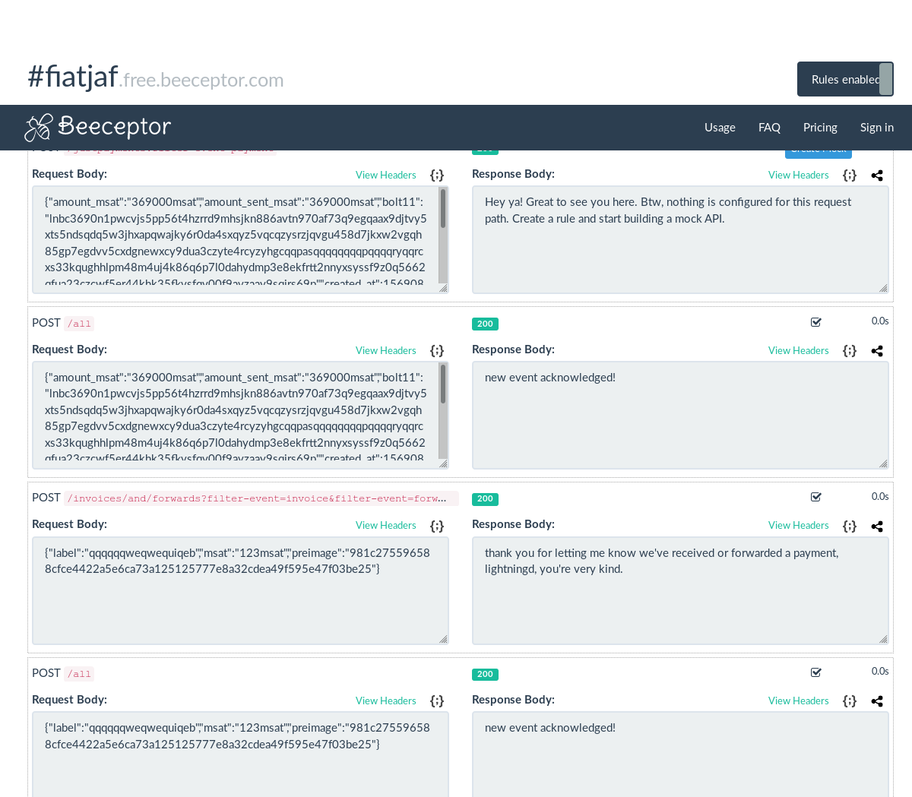

## The `webhook` plugin.

This plugin sends a webhook to any URL when a payment is received, sent or forwarded. It supports filtering just some of these events and dispatching the webhooks to multiple URLs (each can have its own filtering policies).

The payload for each webhook is the _inner object_ of https://lightning.readthedocs.io/PLUGINS.html#invoice-payment, https://lightning.readthedocs.io/PLUGINS.html#sendpay-success and https://lightning.readthedocs.io/PLUGINS.html#forward-event, depending on the kind of event.

## How to install

This is distributed as a single binary for your delight (or you can compile it yourself with `go get`).

[Download it](https://github.com/fiatjaf/lightningd-gjson-rpc/releases) and put it inside the `plugins/` directory of `lightning` folder (or `/usr/local/libexec/c-lightning/plugins/`, I guess, if installed with `sudo make install`) or start lightningd with `--plugin=/path/to/webhook`.

You only need the binary you can get in [the releases page](https://github.com/fiatjaf/lightningd-gjson-rpc/releases), nothing else.

## How to use

Initialize `lightningd` passing the option `--webhook=https://your.url/here` and that's it. You can also write that in your `~/.lightning/config` file. A nice place to get webhook endpoints for a quick test is https://beeceptor.com/.

### Multiple URLs

To dispatch webhooks to multiple URLs, write them separated by commas, like `--webhook=https://first.url/,https://second.url/`.

### Filter events

You can opt to receive only `payment`, `invoice` or `forward` events. To filter (in each URL) append a querystring parameter like `?filter-event=invoice` to the URL. You can repeat that parameter. If no parameters are given, all events will be dispatched.

### Example

In my example configuration I have written the following line in `~/.lightning/config`:

```
webhook=https://fiatjaf.free.beeceptor.com/all,https://fiatjaf.free.beeceptor.com/justpayments?filter-event=payment,https://fiatjaf.free.beeceptor.com/invoices/and/forwards?filter-event=invoice&filter-event=forward
```

Then I got these events at [Beeceptor](https://beeceptor.com/):


