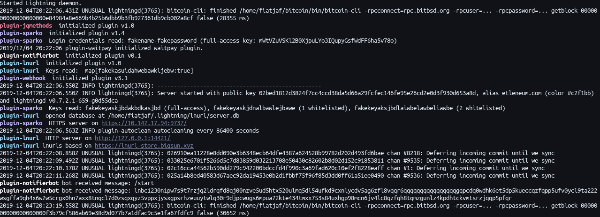

# Easy c-lightning plugin builder

If you love [gjson](https://github.com/tidwall/gjson), hates Go interfaces and want less boilerplate you'll prefer this over https://github.com/niftynei/glightning.

## How to make a plugin

A c-lightning plugin is expected to work as a daemon that listens to JSON-RPC commands on stdin and returns responses on stdout. It's kept alive by `lightningd` for as long as that is alive.

Here you don't have to think about that, just instantiate a [`p = Plugin{}`](https://godoc.org/github.com/fiatjaf/lightningd-gjson-rpc/plugin#Plugin) object, then call `p.Run()`. Done.

To instantiate your `Plugin` struct you'll need some values:

* `Name`: The plugin name, used on logging.
* `Dynamic`: If you want lightningd's `plugin start/stop` commands to work on this.
* `Options`: A list of [options](https://godoc.org/github.com/fiatjaf/lightningd-gjson-rpc/plugin#Option) the plugin will accept from `lightningd initialization. These could be passed either as command-line arguments to `lightningd` or written at the `.lightning/config` file.
* `RPCMethods`: A list of [RPC methods](https://godoc.org/github.com/fiatjaf/lightningd-gjson-rpc/plugin#RPCMethod) with names and descriptions and a "usage" string that describes the accepted and required parameters.
* `Subscriptions`: A list of [subscription](https://godoc.org/github.com/fiatjaf/lightningd-gjson-rpc/plugin#Subscription)
* `Hooks`: A list of [hook](https://godoc.org/github.com/fiatjaf/lightningd-gjson-rpc/plugin#Hook) names and handler functions.
* `OnInit`: A function to run after the plugin has initialized. It will have access to the plugin struct (as a parameter) and you can do odd stuff here, like start a webserver or just do one-off things.

From inside the functions and handlers you'll have access to a `plugin.Plugin` struct with `Args`, the set of options passed to the plugins from lightningd initialization; `Log` and `Logf`, basic logging functions that will print a line to the lightningd logs prefixed with your plugin name; and `Client`, a [lightningd-gjson-rpc](https://godoc.org/github.com/fiatjaf/lightningd-gjson-rpc#Client) client you can use to call methods on lightningd.

With the above, the [](https://godoc.org/github.com/fiatjaf/lightningd-gjson-rpc/plugin) and the [Plugins docs](https://lightning.readthedocs.io/PLUGINS.html#hooks) you'll be able to make any plugin you want.

## Example plugin

```go
package main

import "github.com/fiatjaf/lightningd-gjson-rpc/plugin"

func main() {
    p := plugin.Plugin{
        Name: "useless",
        Version: "v1.0"
        Options: []plugin.Option{
            {
                 "payment-adjective",
                 "string",
                 "How do you want your payments to be called.",
            },
        },
        RPCMethods: []plugin.RPCMethod{
            {
                "donothing",
                "arg1 [arg2]",
                "does nothing with {arg1} and optional {arg2}.",
                "",
                func (p *plugin.Plugin, params Params) (interface{}, int, error) {
                    arg1 := params.Get("arg1").String()
                    arg2 := params.Get("arg2").String()

                    if arg2 != "" && arg2 != arg1 {
                        return nil, -1, errors.New("arg2 is not equal to arg1!")
                    }

                    return map[string]interface{}{
                        "arg1": arg1,
                        "arg2": arg2,
                    }, 0, nil
                },
            },
        },
        Subscriptions: []plugin.Subscription{
            {
                "invoice_payment",
                func(p *plugin.Plugin, params plugin.Params) {
                    label := params.Get("invoice_payment.label").String()
                    adjective := p.Args.Get("payment-adjective").String()
                    p.Logf("%s payment received with label %s", adjective, label)
                },
            },
        },
        Hooks: []plugin.Hook{
            {
                "htlc_accepted",
                func(p *plugin.Plugin, params plugin.Params) (resp interface{}) {
                    // hold the invoice just because you want lightning to fail
                    time.Sleep(30 * time.Minute)
                    return map[string]interface{}{"result": "continue"}
                },
            },
        },
        OnInit: func(p *plugin.Plugin) {
            p.Log("already listening for hooks, subscriptions and RPC methods")
        },
    }

    p.Run()
}
```

## Also

We have colored logs!


